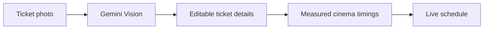

<div align="center">


# Ticked

### Your ticket says 9:00. The film actually starts at 9:18. We timed it.

**A cinema companion for Riyadh that turns a ticket photo into an accurate, live screening schedule.**

[](https://flutter.dev)
[](https://dart.dev)
[](https://supabase.com)
[](https://ai.google.dev)
[](#)

</div>

---

## 🎥 Demo

<div align="center">

**Ticket photo → real schedule → live cinema session**

</div>

https://github.com/user-attachments/assets/6108fc1e-7970-4bad-8792-5253c09163ff

---

## 🎯 The problem

Cinema tickets show when seating begins—not when the film begins.

A **9:00 PM** ticket may mean advertisements until 9:18 and a much later finish than expected. Booking apps stop being useful after checkout, while movie databases know runtimes but not the reality of a specific screening.

**Ticked is built for the two hours every other cinema app ignores.**

---

## ✨ Features

|     | Feature             | Description                                                                                                      |
| :-: | ------------------- | ---------------------------------------------------------------------------------------------------------------- |
| 🎟️ | **Ticket scanning** | Gemini Vision extracts the cinema, branch, film, and showtime from a ticket photo. Every field remains editable. |
|  ⏱️ | **Real schedule**   | Calculates the true start, estimated end, and advertising block using timings measured for each cinema chain.    |
|  📊 | **Live session**    | Tracks advertisements, the film, safe breaks, credits, and credit scenes in real time.                           |
|  🚪 | **Safe breaks**     | Shows suggested moments when you can briefly leave without missing an important scene.                           |
|  🔒 | **Live Activity**   | Displays screening progress on the iOS Lock Screen and Dynamic Island.                                           |
|  📈 | **History & recap** | Saves attended screenings and turns them into yearly statistics.                                                 |

---

## ⚙️ How it works



### Timings researched in Riyadh

The difference between the printed showtime and the film's real start is not published, so we measured it ourselves by attending screenings across Riyadh's five cinema chains.

Each chain stores separate advertising timings for shorter and longer films. This original dataset lets Ticked provide a measured start time instead of a generic guess.

### Current cinema listings

Python scrapers read each chain's website and sync current films and showtimes to Supabase. Branches are hand-managed to prevent inconsistent cinema names from creating duplicate locations.

---

## 🎨 Design system

Ticked is designed like a dark cinema auditorium: warm near-black surfaces, soft off-white text, and one restrained gold accent.

### Palette

<table>
  <tr>
    <td align="center"><br><code>#070402</code><br><sub>Background</sub></td>
    <td align="center"><br><code>#150D09</code><br><sub>Surface</sub></td>
    <td align="center"><br><code>#221813</code><br><sub>Raised</sub></td>
    <td align="center"><br><code>#EEB154</code><br><sub>Gold</sub></td>
    <td align="center"><br><code>#F3EEE6</code><br><sub>Text</sub></td>
    <td align="center"><br><code>#7FB77E</code><br><sub>Safe break</sub></td>
    <td align="center"><br><code>#E07A5F</code><br><sub>Stay seated</sub></td>
  </tr>
</table>

The complete palette is defined in [`app_colors.dart`](lib/constants/app_colors.dart).

### Typography

| Font               | Purpose                                           |
| ------------------ | ------------------------------------------------- |
| **Bebas Neue**     | Display titles and high-impact moments            |
| **JetBrains Mono** | Timers and timestamps with stable tabular figures |
| **Manrope**        | Body text, labels, fields, and buttons            |

Typography is centralized in [`app_typography.dart`](lib/constants/app_typography.dart) and loaded through [`google_fonts`](https://pub.dev/packages/google_fonts).

---

## 🧰 Tech stack

| Layer           | Technology                                         |
| --------------- | -------------------------------------------------- |
| App             | Flutter and Dart                                   |
| Backend         | Supabase Postgres, Auth, RLS, and Storage          |
| Ticket scanning | Google Gemini Vision                               |
| Cinema listings | Python scrapers with daily synchronization         |
| iOS integration | Swift widget extension and `live_activities`       |
| State           | Flutter's built-in `StatefulWidget` and `setState` |

Ticked uses cinema websites instead of TMDB because movie databases know films—not what is playing at a specific Riyadh cinema tonight.

---

## 🚀 Getting started

### Requirements

* Flutter 3.13 or newer
* A Supabase project
* A Google AI Studio API key

### Install

```bash
git clone https://github.com/TickedAlmaneea/Ticked.git
cd Ticked
flutter pub get
cp .env.example .env
```

Add your public credentials to `.env`:

```ini
SUPABASE_URL=https://<your-project>.supabase.co
SUPABASE_PUBLISHABLE_KEY=<your-publishable-key>
GEMINI_API_KEY=<your-google-ai-studio-key>
```

Then run:

```bash
flutter run
```

> [!NOTE]
> The checked-in SQL still needs to be reconciled with the current production schema before local setup is fully reproducible.

For scraper configuration, see [`scripts/README.md`](scripts/README.md). For the optional iOS Live Activity, follow `ios_live_activity_staging/SETUP_CHECKLIST.md`.

---

## 🧪 Testing

```bash
flutter analyze
flutter test
```

---

## ⚠️ Current limitations

* Advertising timings are measured rather than live and must be updated if a cinema changes its reel.
* Ticked currently covers Riyadh only.

---

## 🗺️ Roadmap

* [ ] Reconcile the SQL schema with the running app
* [ ] Secure ticket-scanning requests behind a Supabase Edge Function
* [ ] Release on the App Store and Google Play
* [ ] Add break reminders
* [ ] Expand to more cities after collecting real cinema timings

---

## 👥 Team

| Contributor           | Role                                | Connect                                                            |
| --------------------- | ----------------------------------- | ------------------------------------------------------------------ |
| **Abdullah Almaneea** | Junior Computer Science student     | [LinkedIn](https://www.linkedin.com/in/abdullah-maneea-299376344/) |
| **Latifa Almaneea**   | Senior Software Engineering student | [LinkedIn](https://www.linkedin.com/in/latifa-m-62b518322/)        |

Ticked began as the final project of a Flutter bootcamp and is being prepared for release.

<div align="center">

<br>

<sub><em>That eighteen-minute difference did not come from an API.<br>There is no API. We went to the cinemas and timed it ourselves.</em></sub>

</div>
